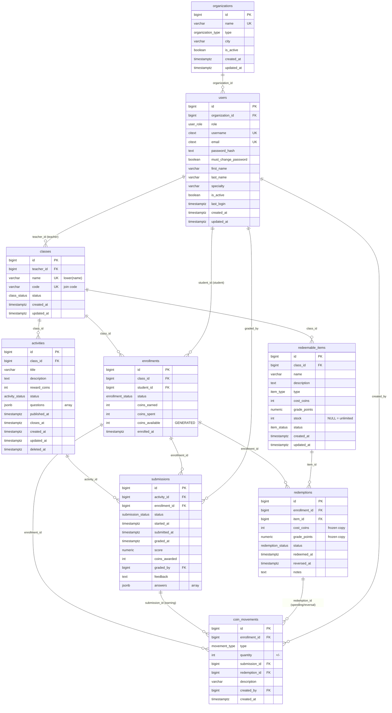

# EduCoins — Base de datos (Especificación MVP)

> **Documento de referencia** para crear y mantener la base de datos de la
> plataforma educativa gamificada EduCoins.
> El SQL ejecutable vive en [`db/001_schema.sql`](../db/001_schema.sql) y
> [`db/002_seed.sql`](../db/002_seed.sql) — este documento **no duplica** el
> script, solo lo especifica (evita divergencias).

---

## 1. Objetivo

Esquema relacional **multi-tenant** (MVP de testeo) donde:

- El **admin** registra organizaciones (escuelas/universidades) y crea usuarios.
- Los **profesores** crean clases con código de unión, publican **actividades**
  con preguntas embebidas (JSONB) y recompensa en monedas, y administra el
  catálogo de **ítems canjeables** (puntos de nota o actividades lúdicas).
- Los **estudiantes** buscan clases por nombre o código, se inscriben, resuelven
  actividades, ganan monedas (por clase y global) y las canjean
  **instantáneamente** por puntos de nota o actividades lúdicas.
- El **ranking global** ordena por monedas *ganadas* (gastar no baja la posición).

## 2. Instrucciones para el agente

1. Usar **PostgreSQL 14+** con codificación `UTF8`.
2. Ejecutar en orden, dentro de una sola transacción cada uno:
   - `db/001_schema.sql` → `psql -d plataforma_educativa -f db/001_schema.sql`
   - `db/002_seed.sql` → `psql -d plataforma_educativa -f db/002_seed.sql`
3. Ejecutar las pruebas de la sección §7 y reportar resultados.
4. **No** renombrar tablas/columnas sin consultarlo: están alineadas con el
   modelo del equipo en ChartDB.
5. **Nunca** guardar contraseñas en texto plano: el campo es `password_hash`
   (bcrypt/argon2 generado por la aplicación).
6. Toda modificación del esquema debe reflejarse en: SQL, este documento y el
   diagrama (ChartDB / Mermaid de la §5).

## 3. Convenciones

| Aspecto | Convención |
|---|---|
| Nombres | `snake_case` **en inglés**, tablas en plural (`coin_movements`) |
| Claves primarias | `BIGINT GENERATED ALWAYS AS IDENTITY` |
| Fechas | `TIMESTAMPTZ` con `DEFAULT now()` |
| Correo y usuario | `CITEXT` únicos (sin distinguir mayúsculas) |
| Estados/roles | Tipos `ENUM` de PostgreSQL |
| Contenido variable | `JSONB` (`activities.questions`, `submissions.answers`) |
| Borrado lógico | `status = 'deleted'` + `deleted_at` en actividades |
| Auditoría | Cada moneda genera fila en `coin_movements` |
| Documentación | Cada archivo SQL/MD lleva cabecera docstring con propósito y uso |

## 4. Reglas de negocio y su mecanismo

| # | Regla | Mecanismo |
|---|---|---|
| 1 | Usuario y correo únicos (case-insensitive) | `UNIQUE` sobre `CITEXT` |
| 2 | Solo el admin puede no tener organización | `CHECK ck_users_org` |
| 3 | Clase con código de unión único | `UNIQUE (code)` + DEFAULT auto-generado |
| 4 | Nombre de clase único sin distinguir mayúsculas | `UNIQUE INDEX lower(name)` |
| 5 | Búsqueda rápida por nombre | Índice `pg_trgm` (GIN) |
| 6 | Estudiante y profesor deben compartir organización | Trigger `fn_validate_enrollment` |
| 7 | La actividad pertenece a una clase (profesor se deduce de ella) | FK simple `activities.class_id` |
| 8 | Estados de actividad: `draft`, `published`, `deleted` | `ENUM activity_status` |
| 9 | Tipos de pregunta: `test`, `completion`, `file`, `minigame` | `JSONB activities.questions` (validación en app) |
| 10 | Archivos (PDF/JPG/PNG) en respuestas | `JSONB submissions.answers[].files` (validación en app) |
| 11 | Solo se entrega una actividad publicada, vigente y estando inscrito en su clase | Trigger `fn_validate_submission` |
| 12 | Un estudiante tiene una sola entrega por actividad | `UNIQUE (activity_id, enrollment_id)` |
| 13 | Al calificar se otorgan las monedas **una sola vez** | Trigger `fn_award_coins` + índice único parcial `uq_movement_earning` |
| 14 | Cada clase tiene su contador; el global es la suma | Columnas en `enrollments` + vista `student_coins` |
| 15 | El saldo nunca es negativo | `CHECK ck_enrollment_no_negative` |
| 16 | Ítems y canjes solo de la misma clase | Trigger `fn_execute_redemption` |
| 17 | El ranking se basa en monedas **ganadas** | Vistas `global_ranking` y `class_ranking` |
| 18 | Cada cambio de monedas queda auditado | `coin_movements` + trigger `fn_apply_movement` |
| 19 | El canje instantáneo descuenta stock y lo revierte si se anula | Triggers `execute/register/reverse_redemption` |

### Reglas postergadas fuera del MVP (futuras iteraciones)

- Tablas de perfil por rol (`administradores`/`teachers`/`students`) → hoy son
  columnas opcionales en `users`.
- Tabla `equivalencias_nota` independiente → hoy la equivalencia vive en el
  ítem (`cost_coins` ↔ `grade_points`).
- Flujo de aprobación/rechazo de canjes → hoy es instantáneo (`completed`/`reversed`).
- Historiales como vistas dedicadas → hoy son consultas directas.
- Varios intentos por actividad → hoy `UNIQUE` de 1 intento (agregar `attempt`).

## 5. Modelo de datos

### 5.1 Diagrama (Mermaid)



### 5.2 Índice de tablas (9)

| Tabla | Claves foráneas | Índices únicos / CHECKs destacados |
|---|---|---|
| `organizations` | — | `UNIQUE(name)` |
| `users` | → `organizations` | `UNIQUE(username)`, `UNIQUE(email)`, `CHECK ck_users_org` |
| `classes` | → `users` (teacher) | `UNIQUE(code)`, `UNIQUE lower(name)`, GIN trgm |
| `enrollments` | → `classes`, `users` | `UNIQUE(class_id, student_id)`, `CHECK spent ≤ earned`, `CHECK ≥ 0`, columna generada |
| `activities` | → `classes` | `CHECK closes_at > published_at`, `CHECK jsonb array`, índice `(class_id, status)` |
| `submissions` | → `activities`, `enrollments`, `users` | `UNIQUE(activity_id, enrollment_id)`, `CHECK jsonb array` |
| `redeemable_items` | → `classes` | `UNIQUE(class_id, name)`, `CHECK cost > 0`, `CHECK grade_bonus ⇒ grade_points`, `CHECK stock ≥ 0` |
| `redemptions` | → `enrollments`, `redeemable_items` | `CHECK cost > 0` |
| `coin_movements` | → `enrollments`, `submissions`, `redemptions`, `users` | `CHECK quantity ≠ 0`, `CHECK coherencia tipo/cantidad`, únicos parciales: 1 `earning`/submission, 1 `spending` y 1 `reversal`/redemption |

### 5.3 Vistas (3) y triggers (7)

- **Vistas:** `student_coins` · `global_ranking` · `class_ranking`
- **Triggers:** `fn_set_updated_at` · `fn_validate_enrollment` ·
  `fn_validate_submission` · `fn_award_coins` · `fn_apply_movement` ·
  `fn_execute_redemption` / `fn_register_redemption` · `fn_reverse_redemption`

## 6. Estructura JSONB

```jsonc
// activities.questions
[{
  "position": 1,
  "type": "test | completion | file | minigame",
  "prompt": "Enunciado (admite KaTeX)",
  "score": 5,
  "expected_answer": "solo completion",
  "options": [{ "text": "3", "is_correct": true }]   // solo test
}]

// submissions.answers
[{
  "question_position": 1,
  "text": "respuesta abierta",
  "option": "3",
  "files": [{ "path": "…", "mime": "application/pdf", "bytes": 12345 }],
  "is_correct": true,
  "score": 5
}]
```

## 7. Verificación (ejecutada — 12/12 OK · 2026-10-02)

Resultado real en PostgreSQL 16 con `001_schema.sql` + `002_seed.sql`:

| # | Prueba | Resultado esperado | Resultado |
|---|---|---|---|
| 1 | Crear entrega y calificar | Otorga 120 monedas | ✅ `earned 120` |
| 2 | Contadores por clase | `earned=120, available=120` | ✅ |
| 3 | Canjear "Trivia" (50 monedas) | `available=70` | ✅ |
| 4 | Stock del ítem | 5 → 4 | ✅ |
| 5 | `global_ranking` | Juan Pérez pos. 1 con 120 | ✅ |
| 6 | Clase duplicada `MATHEMATICS 10a` | **FALLA** `uq_classes_name` | ✅ falló |
| 7 | Canje sin saldo (est.gomez) | **FALLA** `ck_enrollment_no_negative` | ✅ falló |
| 8 | Inscripción a clase de otra organización | **FALLA** `fn_validate_enrollment` | ✅ falló |
| 9 | Recalificar entrega existente | No duplica monedas | ✅ `120` |
| 10 | Revertir canje | Devuelve monedas y stock | ✅ `120/0/120`, stock 5 |
| 11 | Entrega a actividad `draft` | **FALLA** `fn_validate_submission` | ✅ falló |
| 12 | Auditoría | `earning +120`, `spending -50`, `reversal +50` | ✅ |

## 8. Pendientes / siguientes iteraciones

- [ ] Ejecutar en la base de datos del equipo (producción/desarrollo)
- [ ] Validación de tipos de archivo y sanitización de JSONB en la aplicación
- [ ] Integración en tiempo real (WebSockets) leyendo `class_ranking` / `student_coins`
- [ ] Reglas postergadas (§4) según avance del MVP
